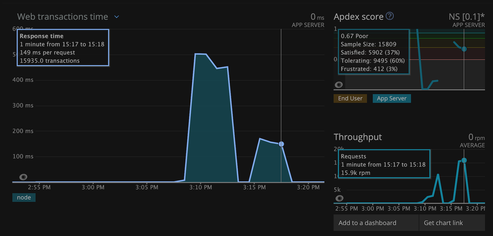
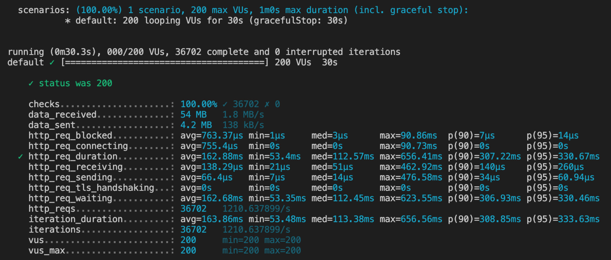

# Creating and Scaling a Backend

# Questions and Answers API
### New Relic

### k6

> I was given a legacy codebase for an e-commerce website and two weeks. I  needed to get the front-end to handle large amounts of data and production-level traffic so I generated a database of around 30 million records.

To start this app run the build script and then, in a second terminal, run the start script. Both scripts can be found in the package.json file.

 - High-Level Deliverables:
    * Built an API using Postgres to support CRUD operations to fit legacy code and conform to REST standards
    * Horizontally-scaled the deployed app on Nginx Round-Robin load balancers and optimized performance under load to meet the following benchmarks:
      > * Response time: 50(ms)
      > * Requests Per Second: 100+
      > * Error rate: < 1%
    * Emulated scenarios of production-level traffic by:
      > * Generated a simulated dataset of more than 10 million realistic JSON records
      > * Stress tested queries with randomized data using k6

